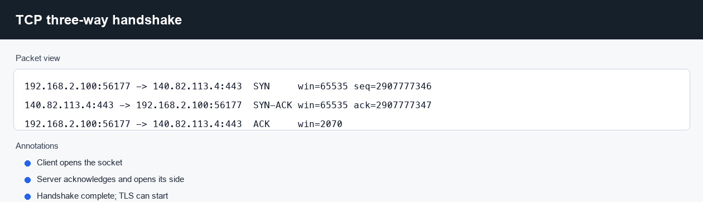
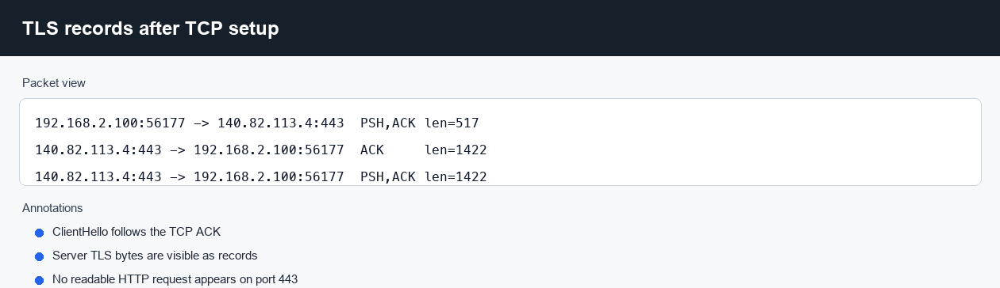
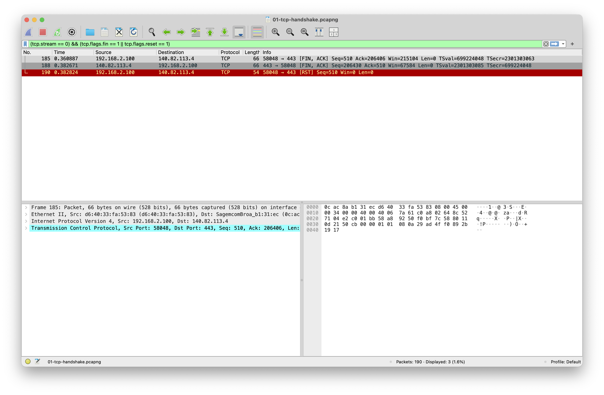

# TCP connection lifecycle

**Question:** Can I identify a TCP session from setup through teardown and point
to where TLS begins?

Capture file: `../captures/01-tcp-handshake.pcapng`

## How the capture was made

Target: `github.com` resolved to `140.82.113.4`.

```zsh
tcpdump -i en0 -s 0 -n -w captures/01-tcp-handshake.pcap \
  "host 140.82.113.4 and tcp port 443"

curl -4 --http1.1 --no-keepalive \
  --resolve github.com:443:140.82.113.4 \
  https://github.com/HendrixMM
```

The `.pcap` output was converted to `.pcapng` with `tools/convert-pcap-to-pcapng.py`.

## What to look at in Wireshark

Display filter:

```text
ip.addr == 140.82.113.4 && tcp.port == 443
```

The first three packets are the TCP handshake:

```text
192.168.2.100:56177 -> 140.82.113.4:443  SYN, win 65535, seq 2907777346
140.82.113.4:443 -> 192.168.2.100:56177  SYN-ACK, win 65535, ack 2907777347
192.168.2.100:56177 -> 140.82.113.4:443  ACK, win 2070
```

After the ACK, the client sends 517 bytes. That is the TLS client hello, not an
HTTP request. The payload is visible as bytes, but the application data is not
readable as HTTP.

Teardown starts when the client sends FIN:

```text
192.168.2.100:56177 -> 140.82.113.4:443  FIN-ACK
140.82.113.4:443 -> 192.168.2.100:56177  FIN-ACK
192.168.2.100:56177 -> 140.82.113.4:443  RST
```

The reset appears after both sides have already exchanged FINs. I would not
treat that as a failed connection; the HTTP request completed and curl closed
the socket.

## Wireshark screenshots






