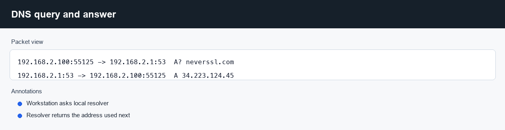
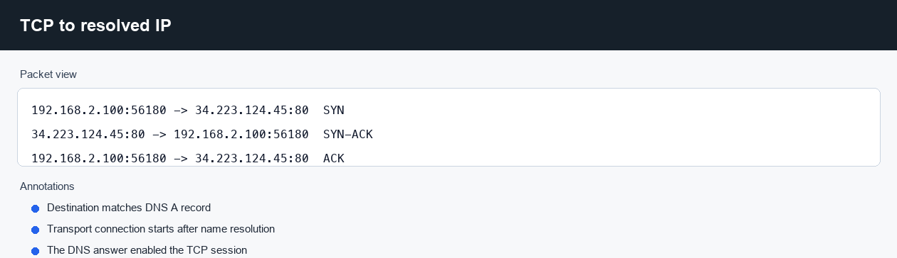
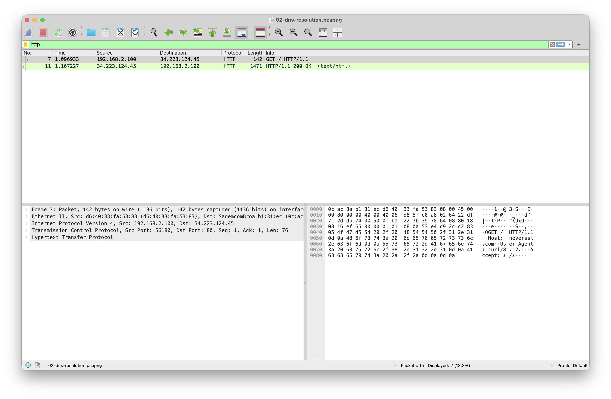

# DNS resolution path

**Question:** Can I tie a DNS answer to the TCP connection that uses it?

Capture file: `../captures/02-dns-resolution.pcapng`

## How the capture was made

Target: `neverssl.com`; local resolver: `192.168.2.1`; A record:
`34.223.124.45`.

```zsh
tcpdump -i en0 -s 0 -n -w captures/02-dns-resolution.pcap \
  "(udp port 53 or tcp port 53 or host 34.223.124.45)"

dig neverssl.com A

curl -4 --http1.1 --no-keepalive \
  --resolve neverssl.com:80:34.223.124.45 \
  http://neverssl.com/
```

`dig` forces the DNS query into the capture. The curl command pins the TCP
connection to the same address returned by the query.

## What to look at in Wireshark

DNS filter:

```text
dns && dns.qry.name == "neverssl.com"
```

The workstation asks the local resolver for an A record:

```text
192.168.2.100:55125 -> 192.168.2.1:53  A? neverssl.com
192.168.2.1:53 -> 192.168.2.100:55125  A 34.223.124.45
```

TCP filter:

```text
ip.addr == 34.223.124.45 && tcp.port == 80
```

The next connection goes to the returned IP:

```text
192.168.2.100:56180 -> 34.223.124.45:80  SYN
34.223.124.45:80 -> 192.168.2.100:56180  SYN-ACK
192.168.2.100:56180 -> 34.223.124.45:80  ACK
192.168.2.100:56180 -> 34.223.124.45:80  HTTP GET /
```

The DNS answer does not move user data by itself. It supplies the address used
by the transport-layer connection that follows.

## Wireshark screenshots






