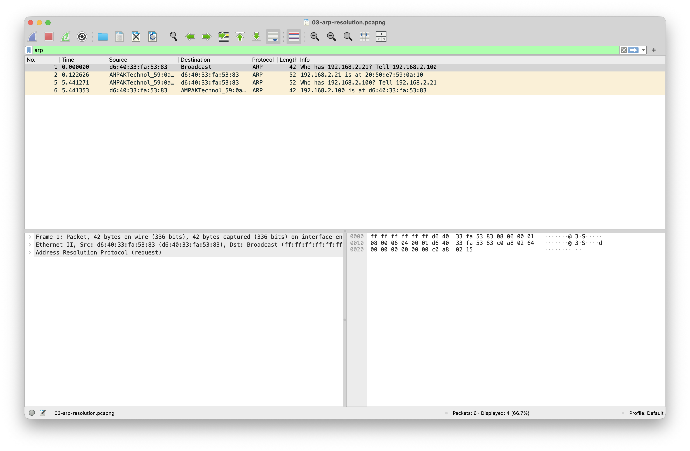
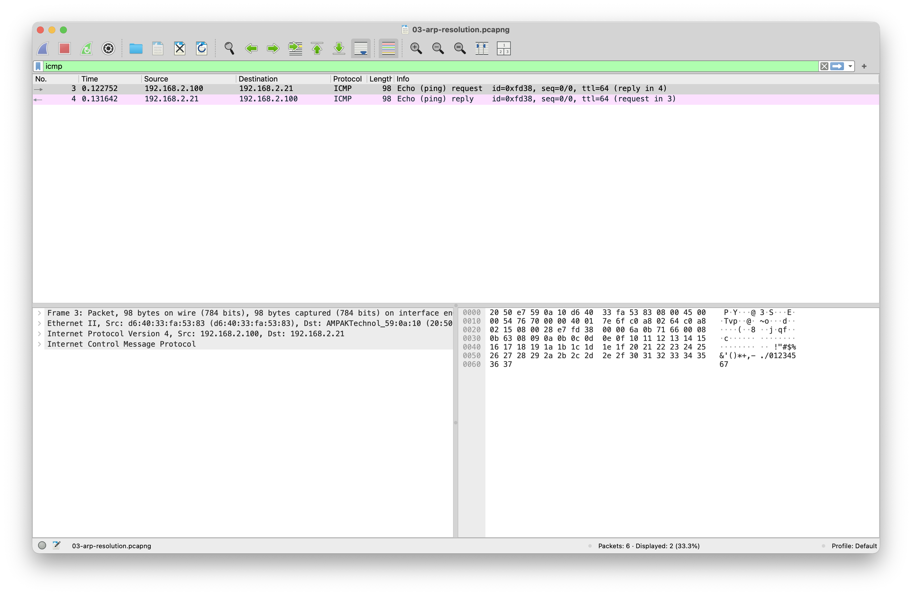
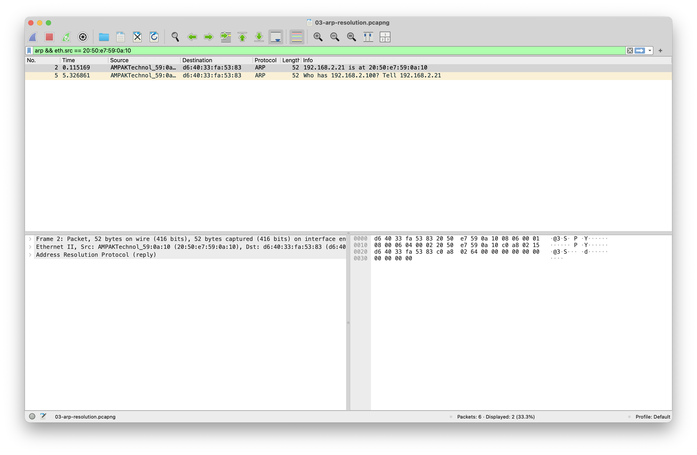

# ARP resolution

**Question:** What has to happen at layer 2 before an ICMP packet can reach a
host on the same LAN?

Capture file: `../captures/03-arp-resolution.pcapng`

## How the capture was made

The ideal command is a cache flush followed by a ping:

```zsh
sudo arp -ad
tcpdump -i en0 -s 0 -n -w captures/03-arp-resolution.pcap "arp or icmp"
ping -c 1 192.168.2.1
```

In this run, `sudo` was not available inside the automation session, so I used
an uncached LAN address instead. A short scan found `192.168.2.21`, then the
capture was filtered down to that ARP and ICMP exchange.

## What to look at in Wireshark

Display filter:

```text
arp || icmp
```

The first ARP request is a broadcast because the sender does not know the
destination MAC address:

```text
d6:40:33:fa:53:83 -> ff:ff:ff:ff:ff:ff  Who has 192.168.2.21? Tell 192.168.2.100
20:50:e7:59:0a:10 -> d6:40:33:fa:53:83  192.168.2.21 is at 20:50:e7:59:0a:10
```

Once the MAC address is known, the ICMP echo request is sent as an Ethernet
frame directly to `20:50:e7:59:0a:10`:

```text
192.168.2.100 -> 192.168.2.21  ICMP echo request
192.168.2.21 -> 192.168.2.100  ICMP echo reply
```

The IP address identifies the peer at layer 3. ARP supplies the destination
MAC address needed to put the frame on the local link.

## Wireshark screenshots






