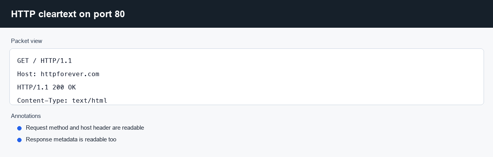
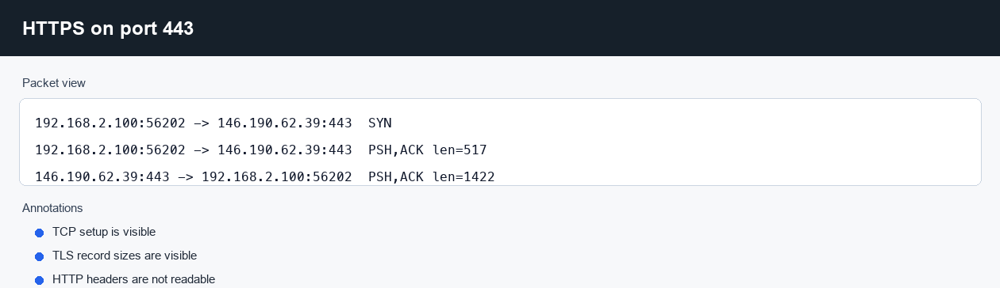
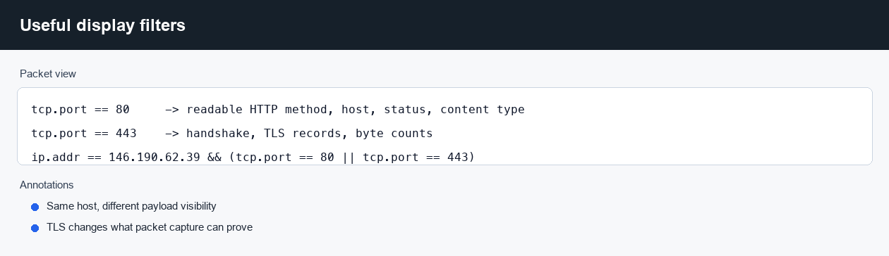

# HTTP vs HTTPS Payload Visibility

**Question:** What changes on the wire when the same host is reached over HTTP
and HTTPS?

Capture file: `../captures/04-http-vs-https.pcapng`

## How The Capture Was Made

Target: `httpforever.com` resolved to `146.190.62.39`.

```zsh
tcpdump -i en0 -s 0 -n -w captures/04-http-vs-https.pcap \
  "host 146.190.62.39 and (tcp port 80 or tcp port 443)"

curl -4 --http1.1 --no-keepalive \
  --resolve httpforever.com:80:146.190.62.39 \
  http://httpforever.com/

curl -4 --http1.1 --no-keepalive -k \
  --resolve httpforever.com:443:146.190.62.39 \
  https://httpforever.com/
```

The `-k` flag was used because the host's HTTPS certificate was expired at the
time of capture. The TLS session still demonstrates payload encryption.

## What To Look At In Wireshark

Cleartext HTTP filter:

```text
tcp.port == 80
```

The request and response headers are visible:

```text
GET / HTTP/1.1
Host: httpforever.com
HTTP/1.1 200 OK
Content-Type: text/html
```

HTTPS filter:

```text
tcp.port == 443
```

The TCP handshake is visible, and so are TLS record lengths, but the HTTP
method, host header, status line, and response body are not readable as
cleartext HTTP.

That difference matters when debugging security products. Packet capture can
still prove that a connection was made, where it went, and whether bytes moved.
It cannot expose protected application data without TLS keys or endpoint logs.

## Annotated Views






